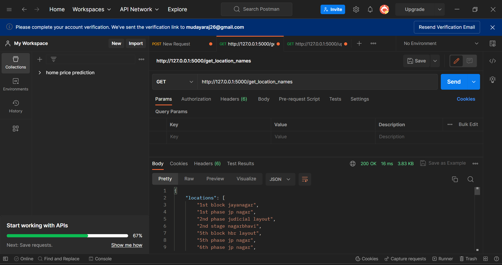
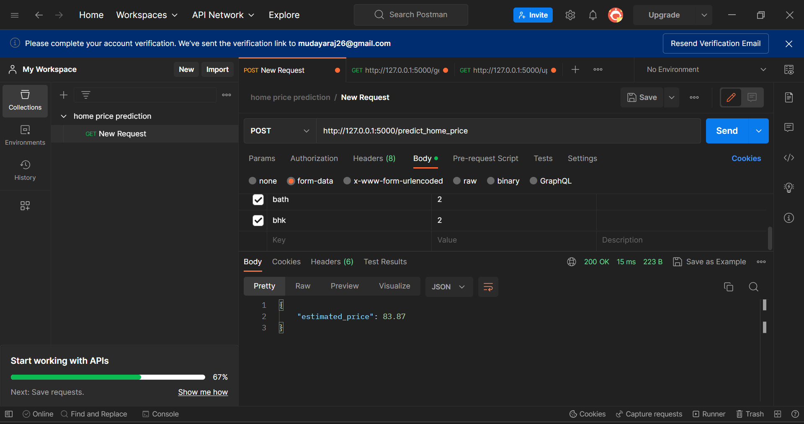

# House Price Prediction

A Machine Learning Model to predict the House price based on the area,number of BHK,number of bathrooms andSqft required.

## Technologies Used

**Client:** HTML,CSS,JS

**Server:** Python Flask.

## Features

This project is used by the following features:

- Size:Input the size of the house Required.
- BHK:Input the number of BHK'size Required.
- Bathroom:Select the Number of Bathrooms Required.
- Location:Select the Preferred Location.

## Web UI

## Client Server Call(Python Flask)

